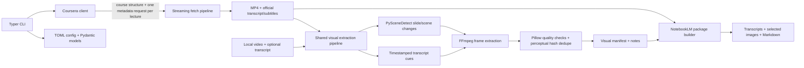

# Coursera Notes

Coursera Notes is a Python CLI for turning course material you are authorized to access into a compact NotebookLM study package. It discovers lecture structure, downloads official Coursera MP4 and transcript/subtitle files, selects useful visual moments from local videos, and writes linked Markdown and images. It does not automate NotebookLM uploads.

## Architecture

Coursera discovery and downloading stay at the source boundary. Course data is normalized into Pydantic models, while transcript parsing, visual selection, and package generation operate on local files and can also be used by the local-video command.



The source adapter boundary is the normalized `Course`/`Lecture` model and the local `video_path` plus optional `transcript_path` accepted by the shared extraction pipeline. A future source can populate those inputs without changing cue matching, scene detection, deduplication, or packaging.

## Requirements

- Python 3.12 or newer
- [uv](https://docs.astral.sh/uv/)
- FFmpeg and ffprobe on `PATH`
- Coursera CAUTH cookie for Coursera commands

The local-video command does not need a Coursera account.

## Install FFmpeg

Install a current FFmpeg build with both `ffmpeg` and `ffprobe` available on `PATH`.

```bash
# macOS with Homebrew
brew install ffmpeg

# Debian or Ubuntu
sudo apt update
sudo apt install ffmpeg

# Confirm both executables are available
ffmpeg -version
ffprobe -version
```

For Windows, install an FFmpeg distribution and add its `bin` directory to `PATH`.

## Install uv and the project

Install uv using the instructions at [docs.astral.sh/uv](https://docs.astral.sh/uv/). On macOS and Linux, the official standalone installer is:

```bash
curl -LsSf https://astral.sh/uv/install.sh | sh
```

Then sync the project and its development tools:

```bash
uv sync
uv run coursera-notes --help
```

## Authentication

Coursera commands require a CAUTH value from a logged-in Coursera session that already has access to the course. Provide a raw token, `CAUTH=<value>`, or a complete Cookie header. The CLI also reads `COURSERA_CAUTH`.

Prefer an environment variable so the token is not written into shell history:

```bash
export COURSERA_CAUTH='your-cauth-value'
uv run coursera-notes inspect machine-learning
```

The `--cauth` option is also available:

```bash
uv run coursera-notes inspect machine-learning --cauth "$COURSERA_CAUTH"
```

CAUTH is a session credential. Do not share it, commit it, put it in `coursera-notes.toml`, or save it in a project `.env`. The application never prints or writes CAUTH values or signed media URLs. `.env.example` is a placeholder only; create no real `.env` in the repository.

## Examples

Inspect a course without downloading media:

```bash
uv run coursera-notes inspect machine-learning
```

Fetch videos and official transcripts/subtitles:

```bash
uv run coursera-notes fetch machine-learning \
  --resolution 720p \
  --language en \
  --output ./output \
  --workers 2
```

On later fetches, a changed selected resolution or transcript language/format replaces the corresponding existing asset so the `lecture.json` record stays accurate. Use `--overwrite` to redownload every selected asset.

Extract visuals from files already fetched:

```bash
uv run coursera-notes extract ./output/machine-learning
```

Build the complete package (fetch, extract, package):

```bash
uv run coursera-notes build machine-learning
```

Package files already fetched and extracted:

```bash
uv run coursera-notes package ./output/machine-learning
```

Process a local video with a local SRT, VTT, or timestamped TXT transcript:

```bash
uv run coursera-notes local lecture.mp4 --transcript lecture.srt
```

Use `coursera-notes --verbose fetch ...` for detailed progress or `coursera-notes --quiet fetch ...` for the final summary only. Options before a command apply to the whole invocation.

## CLI reference

| Command | Purpose |
| --- | --- |
| `inspect COURSE_SLUG` | Show course name, modules, lectures, estimated duration, and transcript languages sampled from up to 10 lectures. It does not download videos. |
| `fetch COURSE_SLUG` | Download MP4 and official transcript/subtitles. Options: `--resolution`, `--language`, `--output`, `--workers`, `--video/--no-video`, `--transcript/--no-transcript`, `--overwrite`, `--cauth`. |
| `extract COURSE_DIR` | Process previously downloaded videos using transcript cues and PySceneDetect. |
| `build COURSE_SLUG` | Run fetch, extract, and package, reusing complete existing files. Accepts the fetch options. |
| `package COURSE_DIR` | Build `notebooklm/` from available transcripts and selected visuals without copying videos. |
| `local VIDEO` | Process a local video through the same visual pipeline. Options: `--transcript`, `--language`, `--output`. |

Common options: `--verbose`, `--quiet`.

For `build --no-video`, the CLI fetches and packages transcripts while skipping visual extraction.

## Output and NotebookLM workflow

Course files use stable ordering and sanitized names:

```text
output/machine-learning/
├── course.json
├── fetch_report.json
├── extract_report.json
├── 01_introduction/
│   └── 01_welcome/
│       └── 01_course-welcome/
│           ├── video.mp4
│           ├── transcript.txt
│           ├── subtitles.vtt
│           ├── lecture.json
│           ├── visual_manifest.json
│           ├── visual_notes.md
│           └── visuals/
│               └── 00-02-31.jpg
└── notebooklm/
    ├── course-overview.md
    ├── manifest.md
    ├── transcript/
    └── visuals/
```

Add the contents of `notebooklm/` to NotebookLM as sources. `manifest.md` links each transcript to its selected visual moments. Original MP4 videos stay outside the NotebookLM package. If Coursera provides subtitles but no TXT transcript, the package converts the downloaded SRT/VTT captions into plain transcript text.

## Configuration

The optional `coursera-notes.toml` in the current directory supplies defaults. CLI arguments override it. Environment variables are used for secrets only.

```toml
[coursera]
resolution = "720p"
language = "en"
workers = 2

[visuals]
scene_threshold = 30
hash_distance = 6
cue_window_seconds = 1.5
jpeg_quality = 88
max_visuals_per_hour = 60
minimum_scene_seconds = 1.5

[output]
root = "./output"
```

## Security and authorized use

- Only download or process course material you are authorized to access.
- This tool uses Coursera's authenticated course APIs and media URLs returned for the signed-in account. It does not bypass DRM, paywalls, authentication restrictions, or access controls.
- Keep CAUTH private. It grants account access until Coursera invalidates it.
- CAUTH is sent only to `www.coursera.org`; streaming media requests do not reuse the authenticated API client.
- Signed MP4 and subtitle URLs are used in memory only and are not written to JSON, console logs, or error messages.
- Filenames are sanitized, output paths are checked against traversal, HTTP timeouts are set, downloads are streamed to `.part` files, and subprocesses use argument arrays without a shell.
- Downloaded media is treated as data and is never executed.

## Current limitations

- Coursera API response fields are undocumented and can change; live validation requires a valid course enrollment and CAUTH session.
- `inspect` samples transcript languages from at most 10 lectures.
- Scene detection and screenshots require FFmpeg/ffprobe and a working PySceneDetect/OpenCV install.
- Cue dictionaries currently include English, French, and Spanish examples; additional phrase sets can be added in `transcript/visual_cues.py`.
- V1 does not include OCR, speech-to-text, LLM ranking, PDF export, web UI, or NotebookLM automation.

## Development

```bash
uv run pytest
uv run ruff check .
uv run mypy src/coursera_notes
```

The unit tests use sanitized fixtures and mocked HTTP responses. The optional FFmpeg integration test creates a tiny two-scene video and is skipped if FFmpeg/ffprobe are unavailable.

## Roadmap

1. OCR and educational-value ranking for selected visuals.
2. Optional PDF/HTML visual packs and clickable local timestamps.
3. Additional multilingual cue dictionaries and source adapters such as YouTube or Udemy, subject to authorized access and platform rules.
4. NotebookLM upload only if an official supported API becomes available.

## License

MIT. See [LICENSE](LICENSE).
